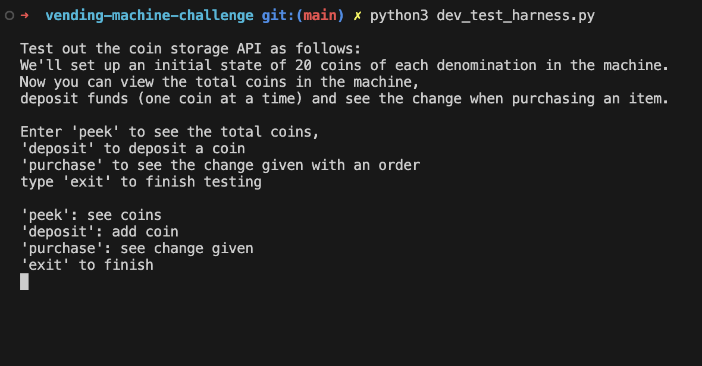

# Vending Machine Change Tracker

## Overview
This API is to be used in conjunction with vending machine software in order to track the coins inside the machine. It is to be set initially with the quantities of each coin denomination which are loaded into the machine and will then update these quantities as the user makes deposits and purchases.

## Design
My program structure includes just one class, since we are only handling the behaviour of changing quantities of coins inside the machine. This is all kept inside the CoinBank class.
Instances of CoinBank are initialised with a dictionary representing the quantities of each coin denomination (£2 ... 1p) and also the value of coins deposited by a user (zero).
So the input parameter is a python list with 8 integers, one for each denomination which then populates the bank dictionary. This class variable, self.bank, stores the coin values (in pence) as keys and their quantities as values. This allows us to handily keep track of and update the quantity of each denomination and also use their monetary value for calculations. Below is an initial plan of the class definition:


There are three main methods on the CoinBank class:

**deposit:** This method allows users to deposit coins, one by one, into the machine and they are be added to the coin bank. The bank dictionary is therefore updated based on the coin which is passed into this method as a parameter.

**dispense_change:** This method takes one parameter (the item's value to be purchased) and calculates the coins required as change based on the current funds deposited and the coin quantities in the bank dictionary. The bank dictionary is updated as required (coins returned as change are removed from the bank) and the method returns a list of the coins to be dispensed to a user.

**reset_funds:** This method sets the deposited funds variable back to zero. Once a purchase is made, reset_funds can be called to reset funds back to zero.

#### Notes on design choices
These decisions have been made when implementing the API:
- I have used pence for the coin values (i.e £1 = 100, 50p = 50) to remove all risk of float rounding errors in calculations.
- I have only allowed the deposit method to take one parameter (i.e, one coin) since the vending machine will only have one coin inputted at a time.
- Based on the given requirements (the program must 'register coins that have been deposited'), I've made the assumption that coins the user deposits are available for the machine to dispense as change, as opposed to just going into a seperate pile of change in the machine.
- I have kept reset_funds in a seperate method in order to ensure that dispense_change *only* handles the behaviour of finding the change (and not returning funds to zero). We could also imagine a scenario in which the funds are incorrect due to a fault with another part of the vending machine, and it must be reset back to zero manually.
- The deposited funds is just stored as the total value of coins deposited so far, since for this exercise we only require the total value in order to calculate the change (and not the individual coin denominations which have been deposited).
- The dispense_change return value is a list of the coin values, as this can be easily iterated through in another part of the software in order to tell the machine which coins to remove from the machine.

#### Edge cases
I have implemented errors with appropriate messages for the following cases:
- If the coin quantities when initialising a CoinBank instance aren't all integers >= 0.
- The value passed into the deposit method is not a valid UK coin denomination (or not an integer).
- The value passed into the dispense_change method is not a valid monetary amount (i.e, an integer < 0).
- The item's value in the dispense_change method is greater than the amount that the user has deposited.
- The bank has run out of the right coin denominations in order to dispense the total amount of change necessary.

**Note on errors:** I have thrown custom errors in this program to handle unexpected inputs and behaviour, however am aware that this will potentially cause crashes and may result in data inside of the memory to be lost if the program is to be restarted. Depending of the broader vending machine software, these exceptions may be caught elsewhere to prevent loss of data, as I have done in the test harness demonstration. However, without having a conversation with other developers on the project, I cannot know this for sure and the exceptions may need to be removed and the methods would simply return error values, like 'None', for example, if something were to go wrong. For the purposes of the exercise, though, I have kept my custom errors in the program.

### Setup and Use

```bash
# clone the repository and cd into it
git clone https://github.com/lplclaremont/vending-machine-challenge
cd vending-machine-challenge

# using pipenv, install dependencies
# (if pipenv isn't already installed, install it using 'pip install pipenv')
pipenv install
```

You can import and use the class now as follows in a python file:
```python
from lib.coin_bank import CoinBank
# define initial quantities of coins in order --> [£2, £1, 50p, 20p, 10p, 5p, 2p, 1p]
coin_quantities = [20,20,20,20,20,20,20,20]

# initialise the coin bank (20 of each coin in the machine)
coin_bank = CoinBank(coin_quantities)

# deposit coins (one coin at a time)
coin_bank.deposit(20)   # 20p coin added
coin_bank.deposit(100)   # £1 coin added
print(coin_bank.deposited_funds)
# --> 120 (£1.20)

# get change for item purchase
change = coin_bank.dispense_change(105)  # item price --> £1.05
print(change)
# --> [10, 5] (10 pence and 5 pence coins)

# return deposited funds to 0
coin_bank.reset_funds()
print(coin_bank.deposited_funds)
# --> 0
```

### Testing
#### Interactive playground
In order to test the behaviour of my code, you can run the command line application in order to view te coins in the bank, make deposits and purchases and see the change that will be returned.
Run it as follows:
```bash
cd vending-machine-challenge
python3 dev_test_harness.py
```
And you'll see the following instructions:
<br>



<br>
Now enter peek, deposit or purchase in order to interact with the code.

#### Pytest
I have written tests in order to ensure the behaviour of the API works as expected. These can be found in the tests/test_coin_bank.py file.
In order to run these tests, use pipenv and run:
```bash
cd vending-machine-challenge
pipenv run pytest
```